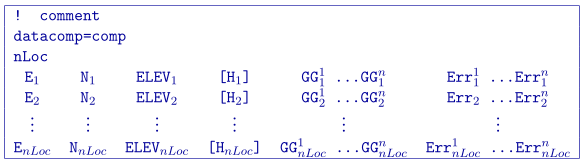
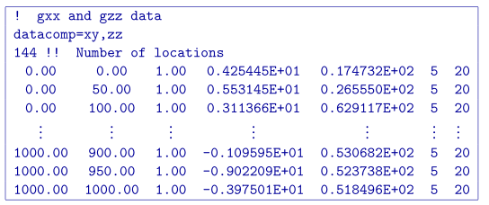
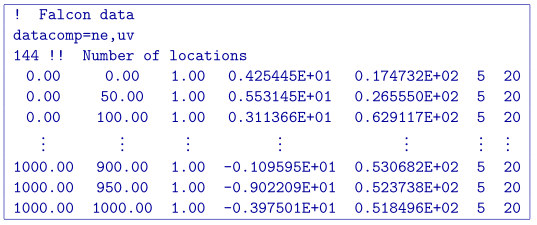
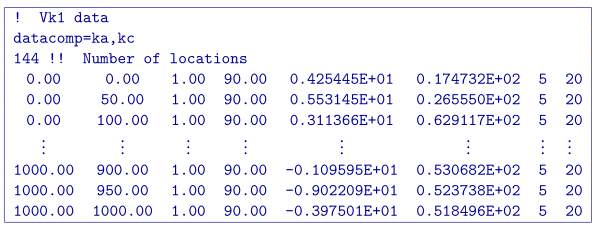

.. _ggfile:

Observations file
=================

This file is used to specify the observed gravity anomalies with estimated standard deviation. The output of the forward modelling program GGFOR3D has the same structure except that the column of standard deviations for the error is omitted. Lines starting with ! are comments. The following is the GIF-formatted file structure of a gravity observations file:

Parameter definitions:

- comp: Flag must start with ``datacomp=`` and then can be set with the following possible flags (followed by comma or space):
    - ``xx`` the :math:`g_{xx}` component (x+ north)
    - ``xy`` the :math:`g_{xy}` component (x+ north; y+ east)
    - ``xz`` the :math:`g_{yz}` component (x+ north; y+ east)
    - ``yy`` the :math:`g_{yy}` component (y+ east)
    - ``yz`` the :math:`g_{yz}` component (y+ east; z+ down)
    - ``zz`` the :math:`g_{zz}` component (z+ down)
    - ``ne`` the :math:`G_{ne}` component for Falcon data
    - ``uv`` the :math:`G_{uv}` component for Falcon data
    - ``ka`` the along-line component for VK1 data (must give sensor heading)
    - ``kc`` the cross-line component for VK1 data (must give sensor heading)

-  nLoc: Number of observation locations.

-  E, N, ELEV: Easting, northing and elevation of the observation, measured in meters. Elevation should be above the topography for surface data, and below the topography for borehole data. The observation locations can be listed in any order.

- H :math:`_i`: The VK1 heading in degrees for the instrument. This number is positive clock-wise (north = 0; i.e. platform heading angle). *Only given* when ``ka`` and/or ``kc`` is given in the data component flag. 
 
-  GG :math:`^n_i`: Anomalous gravity gradient of ith location and nth component (in order of the component flag), measured in Eotvos.

-  Err :math:`^n_i`: Standard deviation of gradient component of the ith location and nth component (in order of the component flag). This is absolute error and must be positive and non-zero.

**NOTE:** It should be noted that the data are **extracted anomalies**, which are derived by removing the regional from the field measurements. Furthermore, the inversion program assumes that the anomalies are produced by a density contrast distribution in g/cm :math:`^3` with mesh cells in metres. Therefore, it is crucial that the data be prepared in ``Eotvos``.

.. _ggPreFile:

Predicted data file
-------------------

The predicted data file is the exact same format as above, but omitting the uncertainty column. The forward modelling and inversion code will output the predicted data in this format.

.. _ggLocFile:

Locations file
--------------

The locations file is the exact same format as above, but omitting the gravity component data and its uncertainty columns. The forward modelling code will read in locations even when the components (and uncertainties) are given.

Example 
-------
Below is an example for FTG data with just the :math:`g_{xy}` and :math:`g_{zz}` data at 144 locations. The :math:`g_{xy}` uncertainties are assigned at a 5 Eotvos and the  :math:`g_{zz}` are assigned at 20 Eotvos. **NOTE**: A file with just the :math:`g_{zz}` would mimic a vertical gravity file, but with the data component flag being ``datacomp=zz``.

Below is an example for Falcon data.

Below is an example for VK1 data with the instrument set directly East: a heading of 90 degrees.

